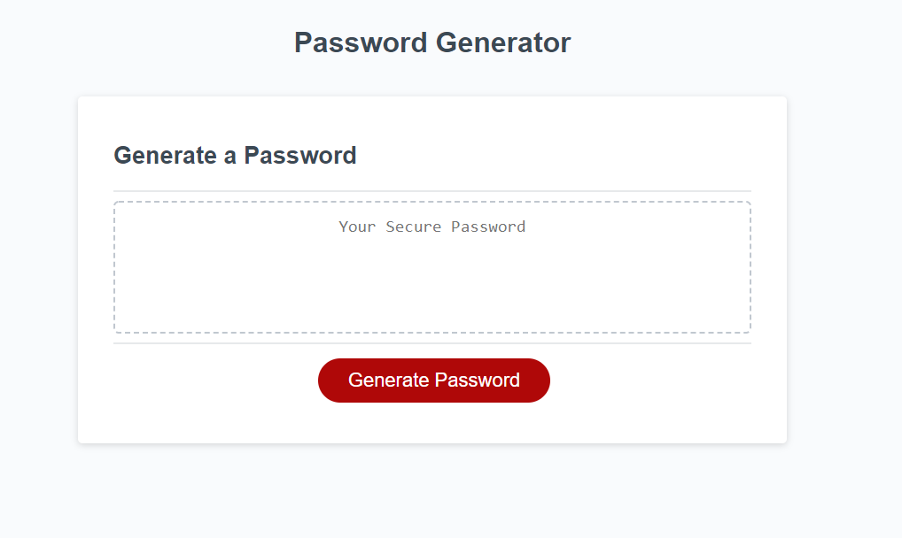

# Password-Generator
Application that generates a random password based on user-selected criteria. 
 
 
## Table of contents
* [General Info](#General-Info)
* [Technologies](#Technologies)
* [Screenshot](#Screenshot)
* [Setup](#Setup)
* [Deployed Project](#Deployed%20Project)

 

### General Info

Application that generates a random password based on user-selected criteria. This app runs in the browser and feature dynamically updated HTML and CSS powered by JavaScript code. It also features a clean and polished user interface and be responsive, ensuring that it adapts to multiple screen sizes.

 

### Technologies
<ul>
<li>Javascript
<li>CSS
<li>HTML
</ul>

 

### Screenshot 

 

 

### Setup

When on landing page (see screenshot) user will be prompted to choose from the following password criteria:

<ul>
<li> Length (must be between 8 and 128 characters)

<li> Character type:

    Special characters 
    Numeric characters
    Lowercase characters
    Uppercase characters

</ul>

The application should validate user input and ensure that at least one character type is selected.

Once all prompts are answered, the user will be presented with a password matching the answered prompts. 

The password is displayed in an alert as well as written to the page instead.

### Deployed Project
